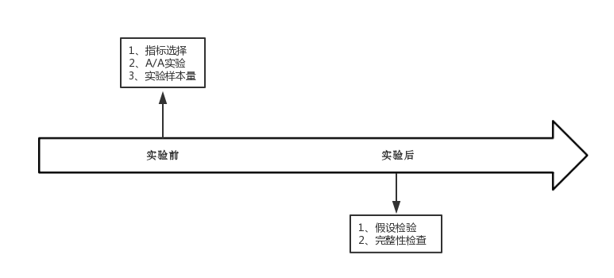
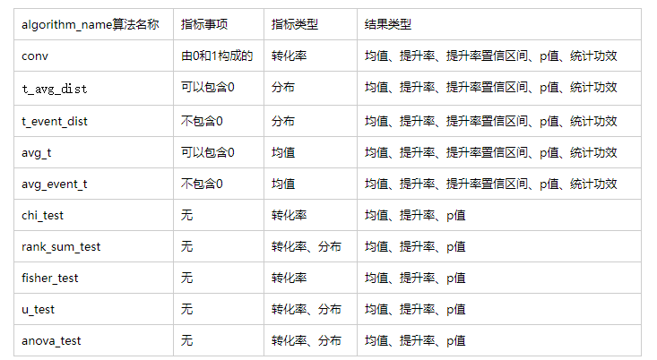

> 使用帮助文档


A/B测试流程图




# 前言
A/B测试是用于比较两个群体之间是否存在差异的工具，前提是假设两个群体之间只存在唯一变量。 本文档介绍A/B测试中输入的数据格式、指标、算法使用方法。
其中数据格式要求为json，暂支持多个指标多个实验组的A/B实验，这里要求指标是同一个类型的；
指标分为转化率、指标的分布、均值，将介绍它们的使用场景和求解算法；算法，将按照不同类型的指标给出几种不同的侯选算法，以及介绍算法适用的场景。


# 数据格式

要求输入的数据为json格式，形式如下：
```
{
    "experiment_param": {                               // 实验参数
        "batch_base": {                                 // 对照组
            "user_list": [1,2,3],                       // uid
            "user_metrics": {
                "user_metrics_1": [1,2,3],              //  第一组指标
                "user_metrics_2": [1,2,3],              //  第二组指标


                "user_metrics_N": [1,2,3]               // 第N组指标
            }
        },
        "batch_comparisons": [                          // 实验组
            {
                "batch_comparisons_1": {                // 实验组 1
                    "user_list": [1,2,3],               // uid
                    "user_metrics": {
                        "user_metrics_1": [1,2,3],      // 第一组指标，与对照组第一组指标对应
                        "user_metrics_2": [1,2,3],      // 第二组指标，与对照组第二组指标对应


                        "user_metrics_N": [1,2,3]      // 第N组指标，与对照组第N组指标对应
                    }
                }
            },
            {
                "batch_comparisons_N": {                // 实验组N
                    "user_list": [1,2,3],
                    "user_metrics": {
                        "user_metrics_N": [1,2,3],
                        "user_metrics_1": [1,2,3]
                    }
                }
            }
        ]
    },
    "algorithm_param": {                    // 算法相关参数，一般情况下默认的，不用修改
        "alpha": 0.05,                      // 显著性水平
        "algorithm_name": "xxxx",           // 使用的算法名称
        "input_power": 0.8                  // 统计功效
    }
}
```

数据分为两部分，`experiment_param`（实验参数）和`algorithm_param`（算法参数），
实验参数中包括对照组、实验组的uid和指标，
算法参数为`alpha`(显著性水平)、`input_power`（统计功效）和`algorithm_name`（算法名称）,
其中，alpha和input_power一般为默认值，alpha=0.05，input_power=0.80，algorithm_name需要指定。关于算法的了解，请看算法部分。


# 指标
前面介绍完数据格式，这里将介绍指标，
在**数据**中对应着数据中的**user_metrics**下的`user_metrics_1`、`user_metrics_2`,...,`user_metrics_N`，给每个uid对应的**指标**。
指标将分为3个类型做介绍。

## 转化率

在评估转化情况中经常使用到的指标，数学上的表达式为转化人数与总的人数之比作为评估指标，优点是将数据归一化，达到可比较的目的。

转化率 = 转化人数 /  总的人数

数据上表现为0和1，即刻画了一个uid是否被转化，转化即为1，没转化即为0，这就在数据上符合了输入格式的要求。


## 指标的分布

以uid作为基准单位，计算指标在每个uid上的数值。一个实验组，就可以得到指标的分布。

- 例如

1、点击次数的分布。实验者应该每个uid 的点击次数，就得到实验组的关于点击次数的分布。

2、充值额的分布。实验者应该每个uid的充值额，就能得到实验组的充值额的分布。


## 均值

均值是指整体上的均值，建立在实验组基础上。其表示实验组的总值与UV的比值。如总的点击次数比上UV，总充值额比上UV

注意：在给数据时，是以每个`uid`的指标来做统计的。

- 例如

1、总点击次数与UV比值，实验者应该给出每个uid的点击次数。

2、总游戏时间与UV比值，实验者应该给出每个uid的游戏时间。


# 算法



将对每个算法做一一介绍，并说明应用的场景（即适用的指标类型）。

## T检验

比较两个分布的均值是否存在差异。

### 场景

- 转化率

由于转化率可以转为只包含0和1的情形，即对比两个分布的差异问题。

1、`在输入数据中，algorithm_name = 'conv'，即表示用T检验算法求解转化率问题。`

- 指标分布

这里的指标分为两种情形，包含0和不包含0，不包含即有uid没有触发指标。

1、`在输入数据中，algorithm_name = 't_avg_dist'，即表示包含0的情形，用T检验算法求解指标分布问题。`

2、`在输入数据中，algorithm_name = 't_event_dist'，即表示不包含0的情形，用T检验算法求解指标分布问题。`

- 均值

均值分为两种情形，uid对应的指标中包含0和不包含0，这里采用改进的T检验来求解，
详细内容见参考文献`Consistent Transformation of Ratio Metrics for Efficient Online Controlled Experiments`

1、`在输入数据中，algorithm_name = 'avg_t'，即表示包含0的情形。`

2、`在输入数据中，algorithm_name = 'avg_event_t'，即表示不包含0的情形。`

## 卡方检验

比较不同组之间的差异大小。

### 场景
- 转化率

1、`在输入数据中，algorithm_name = 'chi_test'`

## Wilcoxon秩和检验

### 场景

- 转化率

1、`在输入数据中，algorithm_name = 'rank_sum_test'`

- 指标分布

1、`在输入数据中，algorithm_name = 'rank_sum_test'`

## fisher精确检验

适用于小样本的检验

### 场景

- 转化率

1、`在输入数据中，algorithm_name = 'fisher_test'`

## 曼-惠特尼U检验

### 场景

- 转化率

1、`在输入数据中，algorithm_name = 'u_test'`

- 指标分布

1、`在输入数据中，algorithm_name = 'u_test'`


## 单因素方差分析

### 场景

- 转化率

1、`在输入数据中，algorithm_name = 'anova_test'`

- 指标分布

1、`在输入数据中，algorithm_name = 'anova_test'`


# 结果

这里介绍两个部分，算法的结果输出和异常捕获输出。

## 算法输出
为了方便，将结果中指标都统一名称。

算法输出：对照组的均值，实验组的均值，提升率，提升率置信区间，p值，统计功效。若是无法给出的值，将以'--'（英文状态下两个横线）代替。

```
{
    "metric_1_comparison_1": {             // 第一个指标，对照组和实验1的结果
        "A_metric_avg": 1.0,                // 对照组的均值
        "B_metric_avg": 1.0,                //  实验组的均值
        "lift": 0.0,                        // 提升率
        "lift_interv_down": "--",           // 提升率置信区间下界
        "lift_interv_up": "--",             // 提升率置信区间上界
        "power": "--",                      // 统计功效
        "pvalue": 0.4338639150461962        // p值
    },
    "metric_1_comparison_2": {              //第一个指标，对照组和实验2的结果
        "A_metric_avg": 1.0,
        "B_metric_avg": 1.0,
        "lift": 0.0,
        "lift_interv_down": "--",
        "lift_interv_up": "--",
        "power": "--",
        "pvalue": 0.4338639150461962
    },
    "metric_2_comparison_1": {             // 第二个指标，对照组和实验1的结果
        "A_metric_avg": 1.0,
        "B_metric_avg": 1.0,
        "lift": 0.0,
        "lift_interv_down": "--",
        "lift_interv_up": "--",
        "power": "--",
        "pvalue": 0.28050811925063585
    },
    "metric_2_comparison_2": {              // 第二个指标，对照组和实验2的结果
        "A_metric_avg": 1.0,
        "B_metric_avg": 1.0,
        "lift": 0.0,
        "lift_interv_down": "--",
        "lift_interv_up": "--",
        "power": "--",
        "pvalue": 0.28050811925063585
    }
}
```

## 异常捕获定义

```
{
    'resultMsg':                    // 报错原因
    ,'resultCode':401,              // 报错代号
    'success':true                  // 显示报错
}
```

- 401

API链接设置不对

- 402

存在空值或者存在0值。如对不允许存在0的指标，若是数据中存在0，就会报错。

- 403

没有指定算法，在传入参数时的algorithm_name没有给参数。


# 样本量预估


实验前预估本次实验大概的样本量，是依据转化率（见下方算法模块）计算得来，数学原理是二项分布近似于正态分布。
`函数模块：`abtest.model.calculator.cal(original,alpha,power,lift,k)

输入数据格式：
```
{
    'original':30,
    'alpha':5,
    'power':80,
    'lift':20,
    'k':6
}
```


`输出：int`

```
{
    "Num": 5761
}
```


需要提供的数据如下：

 - 对照组的转化率original，这是实验者根据历史经验得来的结果。
 - 显著性水平alpha，通常默认为0.05，这里做了预处理，输入整数**5**即可。
 - 统计功效power，通常默认为0.80，输入整数**80**即可。
 - 提升率lift,预估这次的提升率，比如10%，实验者输入10即可。
 - 实验组数k，此次要做的实验个数，包含对照组。比如，要做5组实验，即一个对照组，4个实验组，这里的k=5


## 举例
```
from abtest.model.calculator import cal
cal(original=10,alpha=5,power=80,lift=10,k=5)
## 表示对照组的转化率为20%，预估提升率20%，做5组实验（这里包含对照组在内），算法参数设置alpha=0.05，power=0.80

- 结果
44244
```

说明：这里计算得到的是总的人数，均分到每个实验的人数是N/5,在具体实施实验时候，需将样本量做扩增，避免用户流失等因素造成用户不足的情况发生。

- api链接

```
http://hostname:3000/abtest/calculator
```


# 完整性检验

在实验后期，对比进入实验的用户量比值与实验前配置的比率是否存在差异。

位置： `abtest.model.comple_check.comple_check(na,nb,ratio)`

na : 对照组的数值，比如UV；nb：实验组的数值；
ratio：对照组配置的样本量占整体的比率，如实验前对照组、实验组各自投放500，则ratio=0.50

- 输入数据
```
{
    'na':300,                   // 对照组的样本量
    'nb':550,                   // 实验组的样本量
    'ratio_a':0.45              // 实验前，对照组投放比例
}
```

- 输出

0表示存在差异，1表示不存在差异。

- api链接

```
http://hostname:3000/abtest/completeness_check
```


# API

采用flask构建的web api，位于`/abtest/Api/web_api.py`中，客户端在`JJabtest.Api.client.py`


## 假设检验算法模块

在输入的数据中指定算法名称algorithm_name,得到的api链接为:

```
http://hostname:3000/abtest/algorithm_name
```

## 计算器
```
http://hostname:3000/abtest/calculator
```

## 完整性检查

```
http://hostname:3000/abtest/completeness_check
```


【参考文献】

- 贾俊平, 何晓群, 金勇进. 统计学(第6版)[M]. 中国人民大学出版社, 2015.
- 卡塞拉, 贝耶张忠占, 傅莺莺. 统计推断 : 翻译版[M]. 机械工业出版社, 2010.
- Budylin R, Drutsa A, Katsev I, et al. Consistent Transformation of Ratio Metrics for Efficient Online Controlled Experiments[C]// Eleventh ACM International Conference on Web Search and Data Mining. ACM, 2018:55-63.
- https://research.yandex.com/tutorials/online-evaluation/www-2018#block_slides
